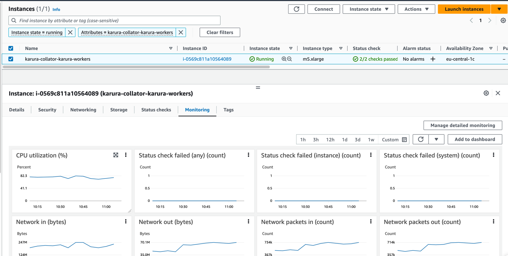

# AWS Deployment

## Pre-requirements
1. Installed [AWS CLI](https://docs.aws.amazon.com/cli/latest/userguide/getting-started-install.html)
2. AWS CLI [configured](https://docs.aws.amazon.com/cli/latest/userguide/cli-configure-quickstart.html) with [programmatic access](https://docs.aws.amazon.com/IAM/latest/UserGuide/id_users_create.html)
2) S3 bucket accessible by AWS CLI User
3) [Optionally] Installed kubectl for interacting with EKS

## Usage
### Configuration
1. Configure variables in [terraform.tfvars](AWS/terraform.tfvars)
 - `project_name` - AWS organization project name;
 - `region` - AWS deployment region, default is `eu-central-1`;

 - `docker_image` - docker image of the collator;
 - `container_args` - collator arguments are specific to collator you are spinning up; no spaces allowed in arguments - separate them with `", "` instead of spaces;
 - `container_command` - command bypassed to collator container.

2. Configure container ports with `container_args` in [terraform.tfvars](AWS/terraform.tfvars) if your collator don't use defaults ports `30333`, `9933`, `9944`

### Optional Configurations
1. Configure variables in [backend.tf](AWS/backend/backend.tf)
- `bucket` - bucket name where tfvars are stored;
- `region` - bucket region.

2. Configure variables in [terraform.tfvars](AWS/terraform.tfvars)
- `eks_node_groups[0].disk_size` - you may specifiy the disk size of the node; default is 500Gb;
- `eks_node_groups[0].instance_types` - you may specify instance size; default is "m5.xlarge".

### Deployment
Once you have configured everything, follow steps below to deploy the collator
- Upload tfvars file to the bucket with `aws s3 cp terraform.tfvars s3://${NAME_OF_THE_BUCKET}/terraform/tfvars/terraform.tfvars --profile ${PROFILE}`
- Install all dependecies with `terraform init`
- [optionally] create a workspace with `terraform workspace new ${COLLATOR_NAME}` if you need to support several collators
- [optionally] select a workspace you are going to work with `terraform workspace select ${COLLATOR_NAME}`
- Check deployment with `terraform plan`
- If everything is planned correctly apply deployment with `terraform apply`
- Verify that your node is syncing via https://telemetry.polkadot.io/

### Update configuration
If you need to update the existing configuration
- [optionally] select the workspace you are going to work with `terraform workspace select ${COLLATOR_NAME}`
- fetch tfvars you have stored previously `aws s3 cp s3://${NAME_OF_THE_BUCKET}/terraform/tfvars/terraform.tfvars terraform.tfvars --profile ${PROFILE}`
- Verify that only required updates are planned with `terraform plan`
- If everything is planned correctly, apply deployment with `terraform apply`
                     
### Examples
Examples of deployment for concrete parachains you can find [here](examples/README.md)

### Interact
After terraform was successfully executed, use the following command to authenticate in  cluster
Do not forget to change name  (in case terraform code was changed and name of the cluster is other), region and profile if need.
`aws eks  update-kubeconfig --name collator-cluster --region eu-central-1 --profile collator`.

After execute command above, use `kubectl` to interact with cluster or install [k8slens](https://k8slens.dev/) (IDE for kubernetes). 
In case subscription would be required, use [this link](https://app.k8slens.dev/subscribe-personal)

### Monitoring
All detailed advanced monitoring you can take a look in [cloudwatch](https://eu-central-1.console.aws.amazon.com/cloudwatch/home?region=eu-central-1) (do not forget to change region in case it is other).
But common used monitoring is located directly in ec2 instance, at monitoring tab, eg

<!-- BEGIN_TF_DOCS -->
## Requirements

| Name | Version |
|------|---------|
|  [terraform](#requirement\_terraform) | >= 1.3.0 |
|  [aws](#requirement\_aws) | 4.48.0 |

## Providers

| Name | Version |
|------|---------|
|  [aws](#provider\_aws) | 4.48.0 |
|  [kubernetes](#provider\_kubernetes) | n/a |
|  [random](#provider\_random) | n/a |
|  [time](#provider\_time) | n/a |

## Modules

| Name | Source | Version |
|------|--------|---------|
|  [ec2\_label](#module\_ec2\_label) | cloudposse/label/null | 0.25.0 |
|  [eks\_cluster](#module\_eks\_cluster) | cloudposse/eks-cluster/aws | 2.6.0 |
|  [eks\_node\_groups](#module\_eks\_node\_groups) | cloudposse/eks-node-group/aws | 2.6.1 |
|  [label](#module\_label) | cloudposse/label/null | 0.25.0 |
|  [subnets](#module\_subnets) | cloudposse/dynamic-subnets/aws | 2.0.4 |
|  [vpc](#module\_vpc) | cloudposse/vpc/aws | 1.1.1 |
|  [vpc\_label](#module\_vpc\_label) | cloudposse/label/null | 0.25.0 |

## Resources

| Name | Type |
|------|------|
| [aws_autoscaling_group_tag.eks_node_groups](https://registry.terraform.io/providers/hashicorp/aws/4.48.0/docs/resources/autoscaling_group_tag) | resource |
| [aws_eks_addon.coredns](https://registry.terraform.io/providers/hashicorp/aws/4.48.0/docs/resources/eks_addon) | resource |
| [aws_vpc_ipv4_cidr_block_association.secondary_ipv4_cidr](https://registry.terraform.io/providers/hashicorp/aws/4.48.0/docs/resources/vpc_ipv4_cidr_block_association) | resource |
| [kubernetes_deployment.collator](https://registry.terraform.io/providers/hashicorp/kubernetes/latest/docs/resources/deployment) | resource |
| [random_integer.octet1](https://registry.terraform.io/providers/hashicorp/random/latest/docs/resources/integer) | resource |
| [random_integer.octet2](https://registry.terraform.io/providers/hashicorp/random/latest/docs/resources/integer) | resource |
| [time_sleep.eks_node_groups_wait](https://registry.terraform.io/providers/hashicorp/time/latest/docs/resources/sleep) | resource |
| [aws_availability_zones.available](https://registry.terraform.io/providers/hashicorp/aws/4.48.0/docs/data-sources/availability_zones) | data source |
| [aws_caller_identity.current](https://registry.terraform.io/providers/hashicorp/aws/4.48.0/docs/data-sources/caller_identity) | data source |
| [aws_eks_cluster.cluster](https://registry.terraform.io/providers/hashicorp/aws/4.48.0/docs/data-sources/eks_cluster) | data source |
| [aws_eks_cluster_auth.cluster](https://registry.terraform.io/providers/hashicorp/aws/4.48.0/docs/data-sources/eks_cluster_auth) | data source |

## Inputs

| Name | Description | Type | Default | Required |
|------|-------------|------|---------|:--------:|
|  [container\_args](#input\_container\_args) | n/a | `list(string)` | n/a | yes |
|  [docker\_image](#input\_docker\_image) | n/a | `string` | n/a | yes |
|  [eks\_node\_groups](#input\_eks\_node\_groups) | n/a | <pre>list(object({     name                = optional(string, "default")     desired_size        = optional(number, "1")     min_size            = optional(number, "1")     max_size            = optional(number, "1")     disk_size           = optional(number, "20")     multi_az            = optional(bool, "true")     kubernetes_version  = optional(string, "1.23")     capacity_type       = optional(string, "ON_DEMAND")     instance_types      = optional(list(string), ["t3.medium"])     ami_release_version = optional(list(string), [])     arch                = optional(string, "amd64")     kubernetes_labels   = optional(map(string), {"node-group-purpose" = "default"})   }))</pre> | n/a | yes |
|  [project\_name](#input\_project\_name) | n/a | `string` | n/a | yes |
|  [aws\_profile\_name](#input\_aws\_profile\_name) | n/a | `string` | `"default"` | no |
|  [aws\_region](#input\_aws\_region) | n/a | `string` | `"eu-central-1"` | no |
|  [container\_command](#input\_container\_command) | n/a | `list(string)` | <pre>[   "" ]</pre> | no |

## Outputs

| Name | Description |
|------|-------------|
|  [account\_id](#output\_account\_id) | n/a |
|  [environment](#output\_environment) | n/a |
|  [project\_name](#output\_project\_name) | n/a |
<!-- END_TF_DOCS -->
